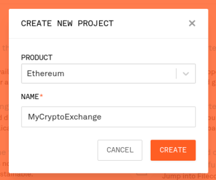
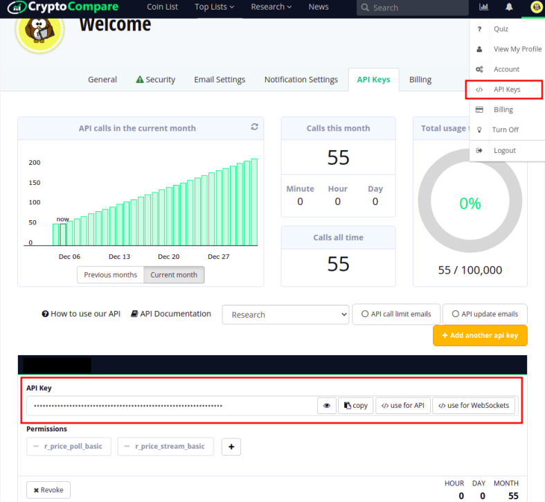

# CryptoExchange

Cryptocurrency Exchange running on the Ethereum Network that allows users to perform simple operations such as checking their balance, figuring out gas fees, selling ETH, among other operations.

<p align="center">
  
</p>


## :coin: Connecting to the Blockchain
Run the main script by typing `python main.py` on your terminal (set-up instructions down below) If everything is alright, you will end up with something like this:

<p align="center">
  
</p>

**Account Address:** The wallet address provided in the JSON file.

**Account Balance:** The balance of the account. This value is provided in Wei, Ether and US dollars.

**Latest Block:** The number of the latest block in the blockchain.

**Test Exchanges:** Exchange rates that might be used later on.

**Gas Price and Transaction Fees:** Shows the gas price and transaction fees in Wei, Gwei, Ether and USD. Notice that in order to perform a single transaction, you will have to pay around 7 US dollars. 

## :ear_of_rice: What are Ether, Gwei and Wei?
Wei is the smallest denomination of Ether, the cryptocurrency coin used on the Ethereum Network. While dollars are only divisible by 100, making pennies, the smallest denomination of the currency. Ether, on the other hand, could be divided by 1,000,000,000,000,000,000. In other words, one ether = 1,000,000,000,000,000,000 Wei. 

Gwei comes from Giga Wei. This is the measure used by most websites such as EtherScan when refering to gas prices. One Ether = 1,000,000,000 gwei.

Further reading [here](https://ethdocs.org/en/latest/ether.html#what-is-ether "ethdocs.org")


## :fuelpump: What is Gas?
Gas fees, Gas units or simple Gas refers to the commission anyone will have to pay to make an operation in the blockchain. Gas units are a totally different measure that are simply used to set a price for the operation. 

Calculating the total transaction fee works as follows: Gas units (limit) * (Base fee + Tip).

Transactions have a fixed **Gas Limit** of 21,000 units, the **Base Fee** is given in GWei and depends on supply and demand, and the **Tip** refers to an additional non-compulsory payment given to the miner to expedite the process.

To fetch the current gas rate we will use the EtherScan API while the CryptoCompare API will be used to convert Ether into fiat currencies. 

Further reading [here](https://ethereum.org/en/developers/docs/gas/ "Ethereum.org")


## :wrench: Configuration
This script fetches data from multiple API endpoints. Let's take a look at them and how we can replicate the process by obtaining our own API’s keys, downloading all necessary packages and updating the JSON configuration file.

**Infura**

Infura will be the door to the Ethereum Network. Its API allows you to access and read data from the blockchain by connecting to a Ethereum node. Unlike the rest of the APIs in this script, Infura connection is carried out with the Web3 package.

Head to [Infura](https://infura.io/ "Infura"), sign up, and create a new project.
 
Remember to choose the “Ethereum” option in the dropdown menu. Your API endpoint will be something similar to: `https://mainnet.infura.io/v3/YOUR_API_KEY`

<p align="center">
  
</p>


<p align="center">
  
</p>


**Web3**

In the wake of Web 3.0, Web3 rose as a solution to easily connect to the blockchain, it is like an interface between you, the programmer, and the network. The installation is fairly simple, a pip install will do:

`pip install web3` or `conda install -c conda-forge web3`


**CryptoCompare**

This website provides real exchanges for all major crypto and fiat currencies. Head to [CryptoCompare](https://www.cryptocompare.com/ "CryptoCompare") and sign in, then, on the API section of the web, click on “Get your free API”. If you are prompted to select the API permissions, choose the ones that will allow you to “read” data. Once set, go to your profile API settings by clicking on your avatar in the top right corner and selecting the “API keys” option. Here you will find the API key.

<p align="center">
  
</p>


**EtherScan**

With a Friendly blockchain interface, this website allows you to easily check for transactions or block details, gas price, etc. Head to [EtherScan](https://etherscan.io/ "EtherScan"), sign in and create your API key by clicking on the “Add” blue button on the API Keys section. We will use this API to retrieve current gas prices.

<p align="center">
  
</p>


**JSON file**

Once you have all the keys and account details (if you don’t have a wallet address you can simply pick one randomly from EtherScan or create your own using [MetaMask](https://metamask.io/ "MetaMask")) we will proceed to update the JSON configuration file (`credentials_ex.json`). This is a dictionary-like object, so we just need to update the value item. Save it as `credentials.json` in the `data` folder.

```
{"account_address": "YOUR_ACCOUNT_ADDRESS", 
"public_key": "N/A", 
"private_key": "N/A",
"infura_url": "https://mainnet.infura.io/v3/YOUR_API_KEY", 
"cryptocompare_api": "YOUR_API_KEY", 
"etherscan_api": "YOUR_API_KEY"}
```

## :computer: Technology stack
Written in python 3. Main modules:

**Web3** -> Blockchain Network connection.

**Requests** -> API connections.

**JSON** -> Files handling.


## :file_folder: Folder structure
```
└── project
    ├── .gitignore
    ├── README.md
    ├── readme
    │   └── readme_images
    ├── notebooks
    │   ├── EthereumConnection.ipynb
    │   └── Together.ipynb
    ├── packages
    ├── main.py
    └── data
        ├── credentials_ex.json
        └── credentials.json 
```

## :love_letter: Contact info
Doubts? Advice?  Drop me a line! :smirk:
